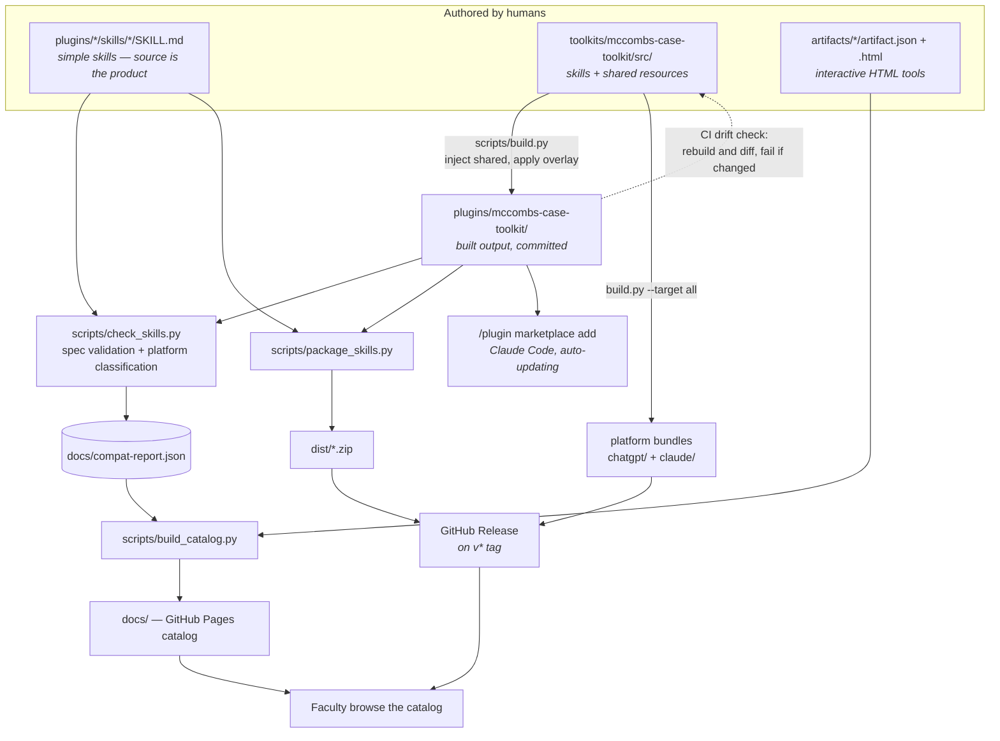

# Architecture

How this repository works and why it is built this way. If you are installing a skill, read
[README.md](README.md). If you are contributing one, read [CONTRIBUTING.md](CONTRIBUTING.md). This
document is for maintainers, and for anyone at another school considering the same approach.

## The problem

A business school wants a shared library of AI skills for teaching. Four constraints shape every
decision below:

1. **Two platforms, indefinitely.** UT has standardized on Claude EDU *and* ChatGPT. A skill written
   for one and unavailable on the other is half a skill. Neither platform is going away, and neither
   is winning.
2. **The authors are faculty, not engineers.** A contribution path that assumes Git fluency
   restricts the library to the handful of people who already have it.
3. **The consumers are faculty too.** "Which of these 12 things do I install, and will it work where
   I use AI?" has to be answerable in about thirty seconds, without jargon.
4. **The institutional hosting story is unsettled.** This lives on public GitHub today. It may move
   to UT's GitHub Enterprise Server, or be mirrored into SharePoint, or be provisioned centrally
   through Claude EDU and the ChatGPT workspace. Nothing should hardcode an assumption that breaks
   on that move.

Everything that follows is a response to one of those four.

## System at a glance



## Repository map

| Path | Role | Edit by hand? |
|---|---|---|
| `.claude-plugin/marketplace.json` | Claude plugin marketplace manifest — lists the three plugins | Yes |
| `plugins/<plugin>/skills/<skill>/` | Installable skills, one folder each (Agent Skills spec) | Yes, **except** `mccombs-case-toolkit` |
| `plugins/mccombs-case-toolkit/` | **Built output.** Generated from `toolkits/` | **No** — CI rejects drift |
| `toolkits/mccombs-case-toolkit/src/` | Canonical source for the case toolkit | Yes |
| `toolkits/mccombs-case-toolkit/platforms/` | Per-platform overlays (ChatGPT agent YAML, Claude `plugin.json`) | Yes |
| `toolkits/mccombs-case-toolkit/toolkit.json` | Which shared files get injected into which skill, plus npm deps | Yes |
| `artifacts/<name>/` | Interactive HTML tools + `artifact.json` manifest | Yes |
| `scripts/check_skills.py` | Spec validator and platform classifier | Yes |
| `scripts/package_skills.py` | Per-skill and per-plugin zips → `dist/` | Yes |
| `scripts/build_catalog.py` | Generates the entire published catalog | Yes |
| `docs/` | **Generated.** Published by GitHub Pages | **No** — regenerate instead |
| `dist/` | **Generated**, gitignored. Zips reach faculty via Releases only | **No** |
| `.github/workflows/validate.yml` | The pipeline that ties it together | Yes |

## Design decisions

### 1. Author in the Agent Skills open standard, not a platform format

A skill is a folder with a `SKILL.md` carrying YAML frontmatter, per the
[Agent Skills specification](https://agentskills.io/specification). Both Claude and ChatGPT consume
this shape.

**Why:** the alternative is maintaining two copies of every skill and watching them diverge within a
semester. Writing to the standard means platform differences get handled at *build* time and
*labeling* time, not authoring time.

**Consequence:** the validator is strict about frontmatter — spec fields only, `name` matching the
directory, description under 1024 characters. Platform-specific extras (`triggers`, `model`,
`allowed-tools`) are tolerated but flagged, because ChatGPT silently ignores them.

### 2. Git is the source of truth, and non-Git contribution is a first-class path

Faculty who do not use Git submit through the GitHub web UI — upload a folder, open a pull request —
following the click-by-click walkthrough in CONTRIBUTING.md. They get the same CI validation and the
same maintainer review as a command-line contribution.

**Why:** constraint 2. A shared drive would be easier to contribute to and would give up version
history, review, automated validation, and any credible path to central provisioning. Making the web
path work well was cheaper than giving those up.

**Consequence:** every check must run in CI, not on a maintainer's laptop, because most contributors
cannot run anything locally. The error messages are written in faculty-facing language for the same
reason.

### 3. Two authoring tiers: plain skills, and toolkits with a build step

Most skills live directly at `plugins/<plugin>/skills/<skill>/`. What is in the repo is what gets
installed. No build, no indirection.

The case toolkit is different. Seven skills share a discipline guide, a Word template, a logo, and a
DOCX generation script. It is authored under `toolkits/mccombs-case-toolkit/src/` as skills plus a
`shared/` directory, and `toolkit.json` declares which shared files are copied into which skill at
build time.

**Why:** the Agent Skills spec has no include mechanism — a skill folder must be self-contained,
because ChatGPT receives it as a standalone zip. Sharing by reference (`../shared/foo.md`) breaks the
moment a skill is packaged alone. Build-time injection is the way to have one canonical copy of a
shared asset and still ship self-contained skills.

**Consequence:** contributors adding a simple skill never encounter the build system. The complexity
is confined to the one place that needs it. Do not promote a plugin to a toolkit until it actually
has shared resources.

### 4. Built output is committed, and CI enforces that it matches

`plugins/mccombs-case-toolkit/` is generated, yet it is checked in. CI rebuilds from source and
`diff -r`s the result; any divergence fails the run.

**Why:** three consumers read skills straight from repo paths — the Claude Code marketplace, anyone
browsing GitHub, and the packaging script. If the built form existed only as a release asset, all
three would break or need a build step they cannot run. Committing it keeps the repo directly
consumable; the drift check keeps the committed copy honest.

**Consequence:** editing the toolkit is a two-step commit — change `src/`, rebuild, commit both:

```bash
python3 toolkits/mccombs-case-toolkit/scripts/build.py --clean --target claude
rm -rf plugins/mccombs-case-toolkit/skills
cp -R toolkits/mccombs-case-toolkit/build/claude/skills plugins/mccombs-case-toolkit/skills
diff -r toolkits/mccombs-case-toolkit/build/claude/skills plugins/mccombs-case-toolkit/skills
```

This is the single most common way to get a red build. It is deliberate: a silent divergence between
source and shipped output is worse than a failed CI run.

### 5. Compatibility is computed, not declared

`check_skills.py` classifies every skill into one of four buckets by inspecting it:

| Classification | Catalog badge | Triggered by |
|---|---|---|
| `both` | Both platforms | Nothing disqualifying found |
| `both-with-caveats` | Both (see notes) | Bundled scripts, Claude-specific frontmatter, subagent or Claude Code references |
| `claude-code-only` | Needs local software | `allowed-tools` containing `Bash(` — needs command-line software installed locally |
| `claude-only` | Claude only | MCP tool references, `~/.claude` paths, session-transcript reads |

**Why:** a self-declared compatibility field is a promise, and promises rot. An author who adds an
MCP call six months later will not remember to downgrade their own badge. Deriving the badge from the
skill's actual contents means it cannot go stale.

**Consequence:** the detection patterns are the contract, and they are heuristics — a skill that
depends on Claude in a way no pattern catches will be mislabeled. Add a pattern when that happens
rather than adding a manual override, or decision 5 collapses back into a declaration.

Every signal string is written for faculty, not maintainers: not "allowed-tools contains Bash(pdflatex)"
but "runs command-line software that must be installed where the skill runs." These strings are
printed in CI output *and* rendered on the catalog, so they only get written once.

### 6. The catalog is generated from the validator's output

`check_skills.py --json docs/compat-report.json` writes a machine-readable record for every skill:
classification, signals, category, version, summary, examples. `build_catalog.py` reads only that
file (plus `artifacts/*/artifact.json`) and generates the whole published site — index, per-skill
detail pages, toolkit pages, artifact pages, and a plain-English "Start here" guide.

**Why:** the catalog is what faculty actually see. Hand-maintaining it guarantees it drifts from the
skills it describes. Generating it from the validator's own output means the badge on the page and
the check in CI cannot disagree — they are the same data.

**Consequence:** `docs/` is disposable. Never edit it; change the generator and rerun. On `master`,
CI regenerates and commits it automatically with `[skip ci]`.

There is a corollary worth stating separately: **all faculty-facing explanation lives in the
`GLOSSARY` and `BADGE_HELP` dictionaries** in `build_catalog.py`. The intro strip, every tooltip, and
the Start Here page all render from them. Explaining "what is a skill" in three places invites three
different answers; this way the copy is edited once and updates everywhere.

### 7. Distribution matches how each platform actually installs things

| Channel | Consumer | Updates |
|---|---|---|
| `/plugin marketplace add johngraff512/mccombs-ai-skills` | Claude Code | Automatic |
| Per-skill `.zip` from the latest Release | ChatGPT, manual Claude upload | Point-in-time |
| Per-plugin `.zip` (`<plugin>-plugin.zip`) | Bulk install | Point-in-time |
| Platform bundles from `build.py --target all` | Case toolkit, either platform | Point-in-time |

**Why:** only Claude Code has a marketplace. ChatGPT takes zip uploads, one skill at a time, 25 MB
maximum. Rather than pretend the platforms are alike, the repo ships the native artifact for each.

**Consequence:** most installs are copies frozen at download time. That is why `metadata.version` is
mandatory and why the catalog displays version and last-updated date on every card — it is the only
signal a faculty member gets that their copy is behind.

Zip builds use a fixed timestamp so that rebuilding unchanged source produces a byte-identical
archive. Without it, every rebuild would look like a new version.

### 8. Nothing hardcodes the GitHub host

`REPO_URL` is derived from `$GITHUB_SERVER_URL` + `$GITHUB_REPOSITORY`, which GitHub Actions sets on
github.com and on GitHub Enterprise Server alike, falling back to the public URL for local builds.

**Why:** constraint 4. If UT moves this to `github.austin.utexas.edu`, a hardcoded host produces a
catalog full of links pointing at a public repo that no longer exists — and it fails silently, since
the pages still build. Deriving the host means the same code emits correct links wherever it runs.

**Consequence:** never write a literal `github.com/johngraff512/...` into generated output. Build it
from `REPO_URL`.

## The CI pipeline

`.github/workflows/validate.yml` runs on every pull request and every push to `master`:

1. **Validate** — `check_skills.py --strict`, writing `docs/compat-report.json`. Errors fail.
2. **Drift check** — rebuild the toolkit from source, `diff -r` against the committed output, fail on
   any difference.
3. **Package** — build all zips into `dist/`, uploaded as a build artifact for inspection.
4. **Catalog** — `build_catalog.py --strict`. Strict mode fails rather than publishing a *guessed*
   per-skill update date, since the result is committed back to `master`.
5. **Commit catalog** — on `master` only, push the regenerated `docs/` as `skills-bot` with
   `[skip ci]`.

On a `v*` tag, a second job revalidates, builds every zip including the platform-specific toolkit
bundles, and publishes them all to a GitHub Release with generated notes.

Checkout uses `fetch-depth: 0` because the catalog reads per-skill "last updated" dates from Git
history; a shallow clone would silently produce wrong dates.

## Extending it

**Add a skill to an existing plugin.** Create `plugins/<plugin>/skills/<name>/SKILL.md` with
frontmatter carrying `metadata.category`, `metadata.version`, `metadata.summary` (one sentence under
200 characters) and `metadata.examples` (two or three realistic prompts). Open a PR. Nothing else —
the catalog picks it up.

**Add a plugin.** Create `plugins/<name>/.claude-plugin/plugin.json` and a `skills/` directory, then
register it in `.claude-plugin/marketplace.json`. The catalog only renders a "Plug-in" card if a
matching `toolkits/<name>/` exists.

**Add an artifact.** Drop the `.html` and an `artifact.json` into `artifacts/<name>/`. Artifacts skip
validation and packaging entirely — `build_catalog.py` copies the HTML into `docs/artifacts/files/`
and renders a detail page. Set `link` to a published claude.ai URL to make "open it in your browser"
the primary path.

**Promote a plugin to a toolkit.** Only when skills genuinely share resources. Create
`toolkits/<name>/` with `src/skills/`, `src/shared/`, `platforms/`, `toolkit.json`, and a build
script; add a drift check to CI. Follow the case toolkit as the reference implementation.

## Gotchas for anyone copying this

- **The default branch is `master`, not `main`.** The workflow, the Pages source, and the catalog
  commit step all name it explicitly.
- **`../` references escaping a skill folder are a defect, not a pattern.** `package_skills.py`
  bundles them into `_bundled/` and prints a warning so the zip still works, but the real fix is
  build-time injection. The skill must be self-contained when it ships alone.
- **ChatGPT caps skill uploads at 25 MB.** `build.py` fails the build rather than shipping an
  oversized zip. Watch the Word templates and images.
- **`markdown` is a required build dependency.** Without it, every generated detail page silently
  degrades to `<pre>` rendering. CI installs it; local builds must too.
- **Upstream sync is manual.** The `business-ai-tools` skills are adapted from
  [Ben Bentzin's MIT-licensed repo](https://github.com/AI-Business-Tools/claude-code) with local
  fixes (Beamer YAML quoting, description length). Keep the attribution; re-check upstream by hand.
- **The toolkit declares its version in four places.** `toolkit.json` is canonical; `package.json`, the
  `VERSION` file shipped inside the Claude bundle, and `platforms/claude/.claude-plugin/plugin.json`
  mirror it. Bump them together — `build.py` refuses to build if they disagree, so a stale mirror
  fails CI rather than shipping a wrong version number to faculty. Everything else derives the number
  from `toolkit.json` at build time.

## Where the rest of the documentation lives

| Document | Audience |
|---|---|
| [README.md](README.md) | Faculty installing a skill |
| [CONTRIBUTING.md](CONTRIBUTING.md) | Contributors, including the no-Git web path |
| [CLAUDE.md](CLAUDE.md) | AI coding agents working in this repo |
| [CHANGELOG.md](CHANGELOG.md) | Release history |
| [toolkits/mccombs-case-toolkit/docs/](toolkits/mccombs-case-toolkit/docs/) | Case toolkit install and maintenance |

Maintained by the AI Faculty Working Group. Contact: john.graff@mccombs.utexas.edu
